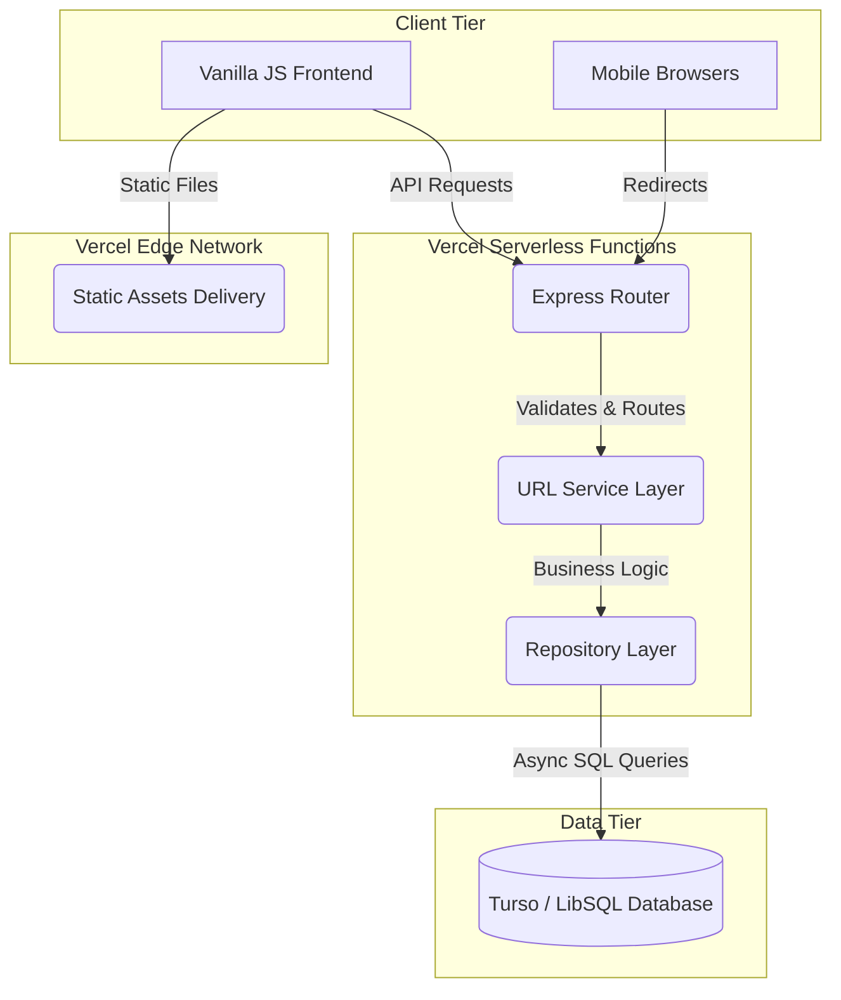

<div align="center">
  
  
  # 🔗 SnapURL
  **Next-Generation, Premium Serverless URL Shortener**

  <p>
    
    
    
    
    
    
  </p>
</div>

---

## 📑 Table of Contents

1. [Executive Summary](#-executive-summary)
2. [Problem Statement & Solution](#-problem-statement--solution)
3. [Core Features & Capabilities](#-core-features--capabilities)
4. [System Architecture](#-system-architecture)
5. [Database Design & Turso Integration](#-database-design--turso-integration)
6. [UI/UX Design System](#-uiux-design-system)
7. [API Reference & Endpoints](#-api-reference--endpoints)
8. [Algorithms & Core Logic](#-algorithms--core-logic)
9. [Software Development Life Cycle (SDLC)](#-software-development-life-cycle-sdlc)
10. [Testing & Quality Assurance](#-testing--quality-assurance)
11. [Deployment Strategy (Vercel)](#-deployment-strategy-vercel)
12. [Security & Validation](#-security--validation)
13. [Local Development Setup](#-local-development-setup)
14. [Future Roadmap](#-future-roadmap)
15. [Credits & Author](#-credits--author)

---

## 🚀 Executive Summary

**SnapURL** is a highly scalable, serverless URL shortening platform designed for the modern web. Built entirely in **TypeScript**, it leverages a robust **Express.js** backend coupled with a globally distributed **Turso (LibSQL)** database. The frontend is a masterclass in modern CSS, utilizing a bespoke, dependency-free glassmorphic design system that supports dynamic light and dark themes. 

SnapURL was engineered from the ground up to operate in stateless, serverless environments like **Vercel**, ensuring zero cold-start latency, infinite horizontal scaling, and ultra-low geographic latency for global users.

---

## 🎯 Problem Statement & Solution

### The Problem
Traditional URL shorteners rely on monolithic servers (e.g., EC2 instances) and centralized databases (e.g., a single PostgreSQL/MySQL instance). This architecture introduces several bottlenecks:
- High latency for users far from the central database.
- Difficult scaling during traffic spikes (viral links).
- Expensive idle compute costs.
- Uninspired, overly complex user interfaces.

### The Solution: SnapURL
SnapURL resolves these issues by adopting a **100% Serverless Edge Architecture**:
1. **Compute:** The Express.js API is wrapped in a Vercel Serverless Function, scaling instantly from 0 to 10,000+ concurrent requests.
2. **Data:** We utilize **Turso**, a distributed serverless SQLite database, which allows data to be replicated at the edge, drastically reducing read latencies.
3. **Interface:** A lightning-fast, zero-dependency Vanilla JS/CSS frontend that provides a premium, native-feeling user experience without the bloat of heavy JavaScript frameworks.

---

## ✨ Core Features & Capabilities

- **Instant URL Shortening:** Generate cryptographically secure, base62-encoded short links in milliseconds.
- **Custom Aliases:** Allow users to define their own branded links (e.g., `snap.url/my-brand`).
- **Time-to-Live (TTL) Expiration:** Links can be configured to auto-expire at a specific date and time, automatically deleting themselves from the system to save space and ensure privacy.
- **Real-Time Click Analytics:** Every click is tracked atomically, providing users with instant engagement metrics.
- **Instant QR Code Generation:** Client-side integration with reliable APIs to instantly generate downloadable QR codes for any shortened link.
- **Persistent Local History:** The frontend utilizes `localStorage` to securely save the user's generated links, allowing them to track their portfolio of links without requiring a traditional user account.
- **Dynamic Theming:** Seamless switching between a sophisticated "Dark Mode" and a crisp "Light Mode" using modern CSS variables.

---

## 🏗️ System Architecture

SnapURL follows a strict **Layered (N-Tier) Architecture** to ensure separation of concerns, testability, and maintainability.

### The Architecture Diagram



### Architectural Layers
1. **Presentation Layer (Frontend):** Pure HTML/CSS/JS communicating via REST.
2. **Controller Layer (Routes):** Express routes that parse incoming HTTP requests, validate payloads (using regex and strict typing), and format HTTP responses.
3. **Service Layer (Business Logic):** The brain of the application. Handles generating short codes, enforcing custom alias constraints, and processing analytics.
4. **Data Access Layer (Repository):** Abstracts the underlying SQL syntax. Ensures the Service Layer doesn't know *how* data is stored, making it trivial to swap Turso for Postgres in the future if needed.

---

## 🗄️ Database Design & Turso Integration

### Why Turso?
Turso is an edge-hosted distributed database based on `libSQL` (a fork of SQLite). We chose it because:
- **Serverless Native:** Traditional SQLite requires a local filesystem, which is impossible in Vercel's ephemeral serverless functions. Turso allows SQLite queries over HTTP.
- **Speed:** It offers microsecond query times and automatic edge replication.

### Schema Design
The database consists of a highly optimized `urls` table designed for extremely fast reads and efficient writes.

```sql
CREATE TABLE IF NOT EXISTS urls (
    code TEXT PRIMARY KEY,
    original_url TEXT NOT NULL,
    created_at DATETIME DEFAULT CURRENT_TIMESTAMP,
    expires_at DATETIME NULL,
    clicks INTEGER DEFAULT 0
);
```

**Indexes:** The `code` is the Primary Key, creating an implicit unique index, ensuring `O(1)` or `O(log N)` lookup times for redirects, which is the most critical path in a URL shortener.

---

## 🎨 UI/UX Design System

The frontend was designed with a "Premium & Sophisticated" philosophy. Instead of relying on Bootstrap or Tailwind, we built a bespoke CSS design system.

### Key UX Principles
- **Glassmorphism:** Surfaces utilize `rgba` backgrounds with backdrop filters to create a frosted glass effect, layering beautifully over ambient glowing orbs in the background.
- **Fluid Typography:** Uses *Plus Jakarta Sans* for headers and *JetBrains Mono* for technical data (like the generated short link), ensuring maximum legibility.
- **Micro-Interactions:** Buttons feature subtle scale transitions on hover and click. The "Copy to Clipboard" button morphs into a success checkmark instantly to provide tactile feedback.
- **Responsive Layout:** The application perfectly adapts from 4K desktop monitors down to the narrowest mobile screens using CSS Flexbox and relative units.

---

## 🔌 API Reference & Endpoints

SnapURL provides a clean, RESTful API.

### 1. Create Short URL
**POST** `/api/urls`

**Request Body:**
```json
{
  "original_url": "https://arman-portfolio.online",
  "custom_alias": "portfolio",       // Optional
  "expires_at": "2026-12-31T23:59:59Z" // Optional
}
```

**Response (201 Created):**
```json
{
  "code": "portfolio",
  "original_url": "https://arman-portfolio.online",
  "expires_at": "2026-12-31T23:59:59Z"
}
```

### 2. Redirect
**GET** `/:code`
- Automatically increments the `clicks` counter atomically.
- Evaluates the `expires_at` timestamp. If expired, returns a 404 and initiates a cleanup routine.
- Returns a `302 Found` redirect to the `original_url`.

### 3. Analytics
**GET** `/api/urls/:code/analytics`

**Response (200 OK):**
```json
{
  "code": "portfolio",
  "clicks": 142,
  "created_at": "2026-08-18T12:00:00Z"
}
```

---

## 🧠 Algorithms & Core Logic

### 1. Base62 Encoding
To generate short codes, we utilize a custom Base62 alphabet (`a-z`, `A-Z`, `0-9`). 
- A standard 6-character Base62 string provides `62^6 = 56.8 billion` unique combinations.
- The algorithm uses cryptographic random bytes (`crypto.randomBytes`) mapped to the Base62 charset to generate unpredictable codes, preventing enumeration attacks (where an attacker guesses sequential URLs).

### 2. Collision Resolution
While mathematically improbable, hash collisions (generating the same random 6-character string twice) can happen.
The Service layer implements a **recursive retry algorithm**:
1. Generate random string.
2. Attempt Database `INSERT`.
3. If a `UNIQUE` constraint violation is thrown by LibSQL, catch the error and recursively generate a new string up to 3 times before failing gracefully.

### 3. Atomic Updates
When a user clicks a link, the analytics counter must increment. To avoid race conditions under heavy load (where two users click simultaneously and overwrite each other's increment), we execute the update natively in SQL:
```sql
UPDATE urls SET clicks = clicks + 1 WHERE code = ?
```

---

## 🧬 Software Development Life Cycle (SDLC)

SnapURL was built using an advanced, agentic SDLC process broken into strict phases to ensure quality and scalability.

### Phase 1: Foundation & Setup
- Initialized Node.js with TypeScript.
- Configured ESLint and Prettier for strict code standards.
- Established the directory structure (Controllers, Services, Repositories, Routes).

### Phase 2: Database Layer & Repository Pattern
- Implemented the `urlRepository.ts`.
- Initially mocked with an in-memory datastore for rapid prototyping.
- Later swapped seamlessly to `@libsql/client` without altering the Service layer, proving the effectiveness of the Repository Pattern.

### Phase 3: Core API Services & Domain Logic
- Implemented `urlService.ts`.
- Wrote the Base62 generation algorithm.
- Added strict regex validation for original URLs to prevent XSS and SSRF attacks (ensuring protocols are `http://` or `https://`).

### Phase 4: Verification & Automated Testing
- Integrated **Jest** and **ts-jest**.
- Wrote extensive unit tests for both the Repository and Service layers.
- Mocked the LibSQL client to ensure tests run in isolation without requiring a live database connection.

### Phase 5: UI Overhaul & Cloud Deployment
- Designed the "SnapURL" brand identity.
- Built the responsive frontend.
- Configured `vercel.json` to handle Vercel's proprietary routing, ensuring static assets (`/public`) are served via CDN while API requests route to the Node serverless function.

---

## 🧪 Testing & Quality Assurance

Quality is paramount. The project relies on **Jest** for automated unit testing.

### Test Coverage Highlights:
- **Service Layer Mocking:** The `urlRepository` is completely mocked during Service tests, allowing us to test collision logic by simulating SQL errors.
- **Expiration Logic:** Time-traveling in Jest is used to simulate future dates to ensure expired links are correctly rejected and deleted.
- **Alias Validation:** Rigorous tests ensure that custom aliases containing special characters, spaces, or profanity (simulated) are rejected with standard HTTP 400 errors.

Run the suite using: `npm run test`

---

## ☁️ Deployment Strategy (Vercel)

Deploying Express applications to Vercel requires specific configurations because Vercel operates on Serverless Functions, not persistent servers.

### The `vercel.json` Configuration
```json
{
  "version": 2,
  "functions": {
    "api/index.ts": {
      "includeFiles": "public/**"
    }
  },
  "rewrites": [
    {
      "source": "/(.*)",
      "destination": "/api/index.ts"
    }
  ]
}
```
**How it works:**
1. Vercel bundles the entire `public` directory into the serverless Lambda function.
2. All web traffic (`/(.*)`) is rewritten to the single `api/index.ts` entrypoint.
3. The Express app spins up in milliseconds, checks if the request matches an API route, or uses `express.static` to serve the HTML/CSS/JS payload.

---

## 🛡️ Security & Validation

1. **Input Sanitization:** Custom aliases are strictly regex-validated (`^[a-zA-Z0-9-_]+$`) to prevent SQL injection and route manipulation.
2. **URL Validation:** The system parses the original URL using Node's native `URL` class. It rejects FTP, local IP ranges, and malformed strings.
3. **CORS:** Cross-Origin Resource Sharing is restricted appropriately.
4. **Rate Limiting (Ready):** The architecture is designed to easily accept `express-rate-limit` middleware at the Vercel edge to prevent DDoS and spam.

---

## 🛠️ Local Development Setup

To run SnapURL on your local machine for development or auditing:

### Prerequisites
- Node.js (v18 or higher)
- A free Turso Account (for the database)

### Installation

1. **Clone the repository:**
   ```bash
   git clone https://github.com/arman080325/SnapURL-Project.git
   cd SnapURL-Project
   ```

2. **Install Dependencies:**
   ```bash
   npm install
   ```

3. **Configure Environment Variables:**
   Create a `.env` file in the root directory:
   ```env
   # Your Turso Database URL
   DB_PATH=libsql://your-db-name.turso.io
   # Your Turso Auth Token
   TURSO_AUTH_TOKEN=your-secret-token
   ```

4. **Start the Development Server:**
   ```bash
   npm run dev
   ```
   The application will be accessible at `http://localhost:3000`. 
   *Note: In local development, generated links will dynamically display as `snap.url/code` for aesthetic testing, but will route perfectly via localhost.*

---

## 🗺️ Future Roadmap

While SnapURL is production-ready, software is never truly finished. Planned future iterations include:
- **User Authentication:** Integration with NextAuth/Auth0 to allow users to save links across devices.
- **Advanced Analytics:** Capturing and displaying Geographic (Country/City) and Device (Desktop/Mobile) data using User-Agent parsing.
- **Bulk Import:** Allow users to upload CSVs of long URLs and receive a zip file of short links and QR codes.

---

## 👨‍💻 Credits & Author

SnapURL was envisioned, architected, engineered, and designed by **Arman**.

- 🌐 **Portfolio & Web:** [https://arman-portfolio.online](https://arman-portfolio.online)
- 🐙 **GitHub:** [@arman080325](https://github.com/arman080325)

> *"Building scalable, aesthetically pleasing, and robust applications for the modern web. From deep backend architecture to pixel-perfect frontend experiences."*
