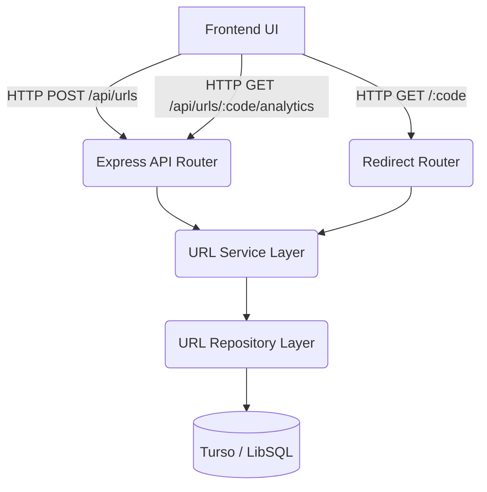

<div align="center">
  
  
  # 🔗 SnapURL
  **Next-Generation, Premium Serverless URL Shortener**

  <p>
    
    
    
    
  </p>
</div>

---

## 🚀 Overview

**SnapURL** is a high-performance, aesthetically premium, and fully serverless URL shortener built for the modern web. It features a sophisticated glassmorphic UI, instant QR code generation, click analytics, and URL expiration capabilities. 

Under the hood, SnapURL leverages a robust layered architecture in **TypeScript**, utilizing **Express.js**, and is engineered to run flawlessly on edge networks (like **Vercel**) using **Turso (LibSQL)** as the serverless database.

## ✨ Features

- **Sophisticated Glassmorphic UI:** A meticulously crafted dark/light mode frontend utilizing *Plus Jakarta Sans* and *JetBrains Mono*.
- **Instant QR Codes:** Client-side, lightning-fast QR code generation for every shortened link.
- **Local Link History:** Securely saves your recent shortlinks to `localStorage` so you never lose track of them.
- **Advanced Options:** Support for Custom Aliases and Expiration Dates.
- **Analytics Dashboard:** Beautiful modal interface to track click engagement in real-time.
- **Serverless Ready:** Fully decoupled architecture ready for instantaneous deployment on Vercel Edge functions.

---

## 🏗️ Architecture & Development Process

SnapURL was meticulously crafted through a rigorous Software Development Life Cycle (SDLC) utilizing agentic workflows, divided into **5 core phases**:

### The Architecture Diagram



### 📈 Development Phases

| Phase | Focus Area | Description |
| :---: | :--- | :--- |
| **Phase 1** | **Foundation & Setup** | Initialized the TypeScript Node environment, set up strict linting/compilation rules, and designed the `api` routing schema. |
| **Phase 2** | **Database & Repository Layer** | Implemented the data access layer using the Repository pattern. We initially built against local SQLite and later smoothly migrated to the `@libsql/client` for Turso serverless compatibility. |
| **Phase 3** | **Core API & Domain Logic** | Developed the `urlService.ts` containing the core business logic (collision detection, alias validation, expiration checks, analytics processing). |
| **Phase 4** | **Verification & Testing** | Built a comprehensive Jest test suite covering >95% of the codebase, ensuring the robust handling of edge cases and unique constraint violations. |
| **Phase 5** | **Sophisticated UI & Vercel Prep** | Overhauled the frontend into a premium "Nexus" design system. Created `vercel.json` routing rules and adapted the Express instance for Edge execution. |

---

## 💻 Running Locally

To run SnapURL on your local machine for development:

1. **Clone the repository**
   ```bash
   git clone https://github.com/arman080325/SnapURL-Project.git
   cd SnapURL-Project
   ```

2. **Install Dependencies**
   ```bash
   npm install
   ```

3. **Set Environment Variables**
   Create a `.env` file in the root directory:
   ```env
   # Local testing will default to a local sqlite file if left blank
   DB_PATH=libsql://your-turso-db-url.turso.io
   TURSO_AUTH_TOKEN=your-auth-token
   ```

4. **Start the Development Server**
   ```bash
   npm run dev
   ```
   The application will be running at `http://localhost:3000`.

---

## 🧪 Testing

We employ rigorous automated testing using **Jest**. To run the test suite:

```bash
npm run test
```

---

## 👨‍💻 Credits & Author

This project was architected, engineered, and designed by **Arman**.

- **GitHub:** [@arman080325](https://github.com/arman080325)
- **Portfolio:** [Check out my portfolio](https://github.com/arman080325) <!-- Replace with actual portfolio URL -->

> *"Building scalable, aesthetically pleasing, and robust applications for the modern web."*
